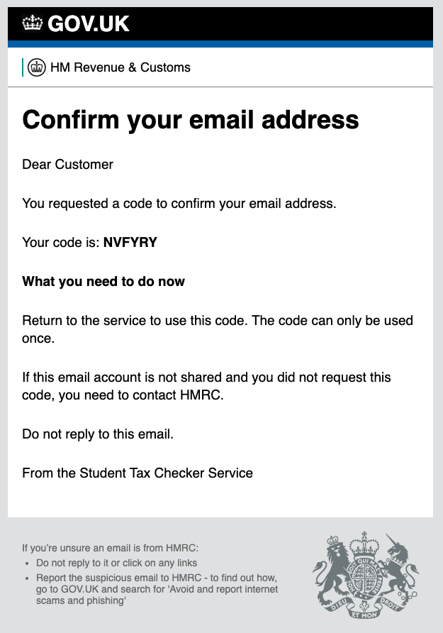
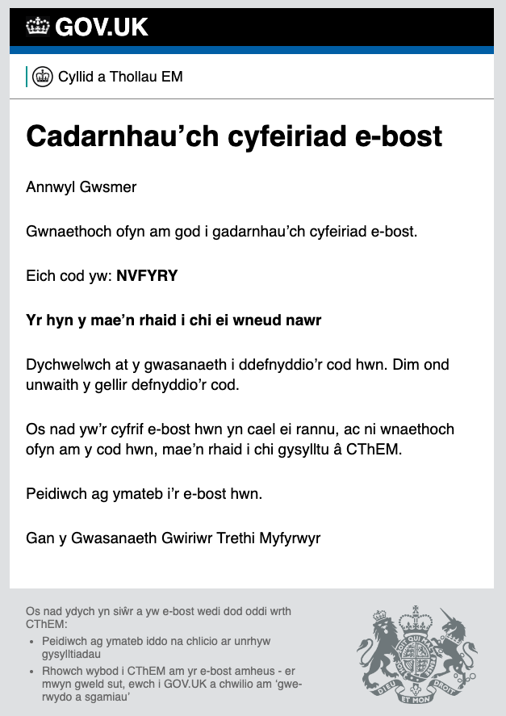
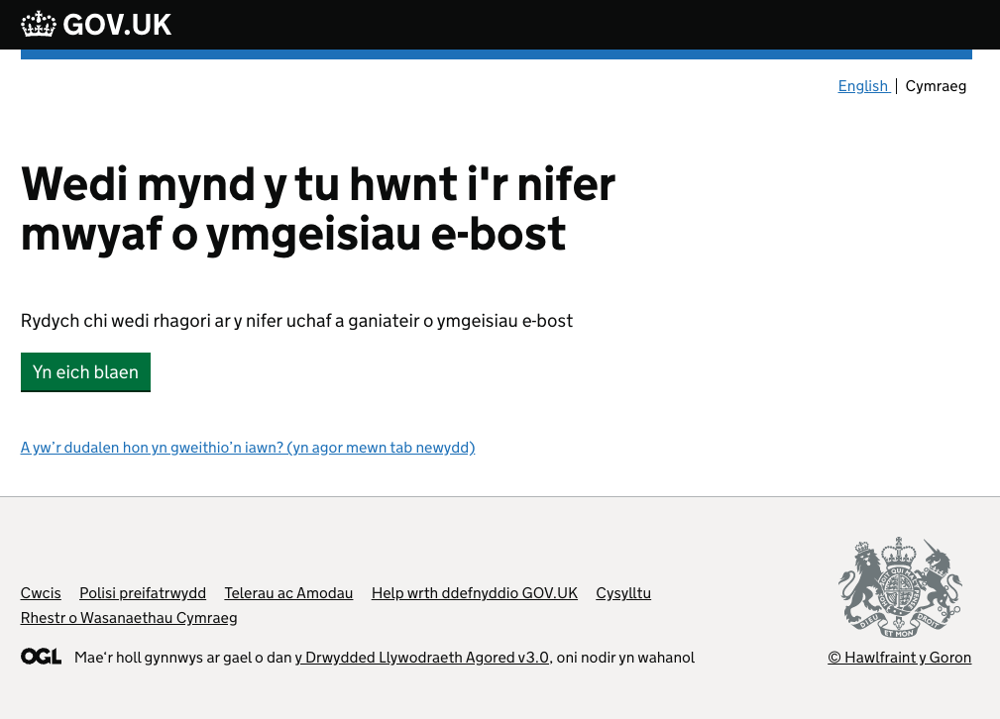

# email-verification

**Note: Link Based Verification was ***Deprecated*** as of March 22.** 

# <a id="toc">Table of Contents</a>

- [Overview](#overview)
  - [How to build and test](#how-to-build-and-test)
  - [Quick start guide](#quick-start-guide)
  - [Locking strategy](#locking-strategy)
  - [Link-based deprecation](#link-based-deprecation)
- [Details](#details)
- [FAQ](#faq)
- [Screenshots](#screenshots)
  - [Email entry screen](#email-entry-screen)
  - [Sent email with Passcode](#sent-email-with-passcode)
  - [Passcode entry screen](#passcode-entry-screen)
  - [Lock out screen](#lock-out-screen)
- [API](#api-endpoints)
  - [POST /verify-email](#post-verify-email)
  - [GET /verification-status/:credId](#get-verification-status)
- [Test-only routes](#test-only-routes)
  - [GET /test-only/passcodes](#get-test-only-passcodes)
- [License](#licence)

# <a id="overview">Overview</a>

The ```email-verification``` is a generic service for an email address verification journey. Optionally, it provides a default [email entry screen](#email-entry-screen) should the calling service not provide an email address to verify.

The originating service initiates the journey via a [POST](#post-verify-email) request to email-verification. The user is sent an email with a passcode inside. They must then copy this code into a passcode entry screen provided by this service. See [screenshots](#screenshots) below. Once they've completed this task the user is then redirected back to the original calling service which then calls a [GET](#get-verification-status) status endpoint on email-verification to determine the outcome of the user's email-verification journey. Within this email-verification service, there is retry & [locking](#locking-strategy) logic which is detailed below, and the lock status is also available to the originating service.

This is a fire-n-forget email service.  It has no means to confirm that the email has been delivered.

## <a id="how-to-build-and-test">How to build and test</a>

Preconditions:
```mongod``` needs to be running for ```it:test```

```sbt clean compile coverage test it:test coverageReport```

Testing: there is an [email-verification-stubs](https://github.com/hmrc/email-verification-stubs) service that may assist locally or in other test environments.  This mimics the targetted email-sending service POST /hmrc/email and the stub can be used when the sending of an email for real is not desirable.

You must have a logged in session to use email-verification. The credId of that user must match the credId of the user on the passcode screen that is verifying the emailed passcode.

Passcodes are only generated with letters that are not vowels. In testing, if you try with a non-vowel code, the locking will not operate.

## <a id="quick-start-guide">Quick start guide</a>

Firstly, decide if your service is capturing the email address to verify or are relying on the [default page](#email-entry-screen) that is provided by this service.  Omitting the ```email``` section in the [POST request payload](#post-verify-email) will make use of the default [email entry screen](#enter-email) in this service.

The endpoints for the originating service to call are:

- start with [POST /verify-email](#post-verify-email)

- originating service then redirects to the supplied ```redirectUri``` in the response payload.

- email-verification redirects the user back to the originating service's ```continueUrl``` taken from the above POST request payload.

- originating service calls [GET /verification-status/:credId](#get-verification-statuscredid) to obtain the journey outcome.

## <a id="locking-strategy">Locking strategy</a>

If the user exceeds 5 (3 in test) passcode entry tries or different email address combinations, the user will be locked out of ```email-verification``` for 24 hours.

More information on this is under [Details](#details).

## <a id="link-based-deprecation">Link-based deprecation</a>

This service supports both link-based & passcode email verification. Link-based verification was deprecated in this service in March 22.

All new callers of this service MUST use the [passcode API](#api-endpoints).

Link-based verification is against recent Security Best Practise, as links in emails are used in emails phishing attacks. We should only use passcode-based email verification, and this is where the IT industry is moving.

Additionally, we have had a number of Live Support tickets where the user's email client involves a URL rewriter and this tends to mangle the URL meaning a user's attempt to click the link and verify their email address fails.

We urge all services currently using link-based email verification to move over to the new passcode [API](#API).  At some future point, the deprecated link-based verification will be removed from this service after suitable comms.

# <a id="details">Details</a>

On the start endpoint [POST /verify-email](#post-verify-email), if the email is not supplied, then a generic screen will appear to ask the user to enter their email address noting Welsh is supported. This means that the originating service doesn't need to provide any email-verification screens; it can just call the email-verification service with a blank email address and this will then redirect redirect back to the originating service upon completion.

If the user aborts the email-verification attempt, the user will obviously not be redirected back to the originating service.

On a redirect to the calling service, it will then call the [GET](#get-verification-status) endpoint to obtain the verification status outcome. This will be in the form of a pair of flag fields, verified & locked. The email-verification service will maintain the outcome of this verification for 24 hours, after which the record will be deleted.

The calling service should note these GET response payload flag combinations:

| verified  | locked | comment                           |
|-----------|--------|-----------------------------------|
| true      | false  | Happy outcome                     |
| false     | true   | Unhappy outcome                   |
| true      | true   | Never returned                    |
| false     | false  | Never returned. An internal state |

**The onus is on the originating team to store the outcome of the journey** : the calling service invokes the callback [GET](#get-verification-status) endpoint on journey completion and then should immediately store the outcome of the callback. If not ```verified=true``` then the calling service needs to decide on what to do, what needs to be persisted, etc, noting if no persistence then the user could retry if ```locked=true``` after 24 hours.  This may be fine depending on your requirements.

The locking strategy is that 5 failed attempts locks any email verification attempt for 24 hours by credId. If that user tries to verify a locked email address, the POST by the calling service will return a 401/Unauthorised (*). Any subsequent call to the GET callback endpoint will reveal a status of ```locked=true``` for the duration of the 24 hour locked period. If the calling service provided the email address, then email-verification checks the locked status before the email verification commences. No email-verification screens will be shown to the user if the email is deemed to be locked, and the calling service will need to handle the subsequent "email locked" journey.

(*) in retrospect, 403/Forbidden might have been better.

For a user (credId) that has performed two email verification attempts using different emails in a 24 hour period, this example shows what the GET endpoint would return:

Request:
```GET /verification-status/:credId```


Response payload with a 200/OK status code:
```json
{
   "emails":[
      {
        "emailAddress":"fredbloggs@hotmail.com",
        "verified":true,
        "locked":false
      },
      {
         "emailAddress": "somename@live.com",
         "verified":false,
         "locked":true
      }
   ]
}
```

If the returned status is ```verified=false``` or ```locked=true```, it is up to the calling service as to how to handle this, noting email-verification provides 5 user retries. Our recommendation is that you fail this user from the email verification journey and provide an alternative means to verify the user.

# <a id="faq">FAQ</a>

Q: in [POST /verify-email](#post-verify-email), what is the purpose of the ```credId``` (aka surrogate account ID), ```origin``` & ```continueUrl```?

A: the ```credId``` is used to assist the locking strategy. We add the ```origin``` into the POST response's payload ```redirectUri``` attribute to aid support & for noting in the Help Desk tickets. The ```continueUrl``` is used to redirect the user back to the calling service once the journey has completed.

Q: does a 50X response from [POST /verify-email](#post-verify-email) means the email failed to send. Does it make sense for us to handle this small glitch?

A: this service is a fire-n-forget email sender. Whilst we have not experienced any support issues around a 50X being returned, it is worth the originating service logging and alerting if this happens. In this circumstance, it's up to the original calling service as to how to handle the subsequent user journey.

Q: if a user is on the ['Enter passcode'](#passcode-entry-screen) page and they try to force their way back to the calling service by navigating to our callback url via their browser without supplying a valid passcode, is there a scenario where we get a response back from the GET endpoint which doesn’t have the email address in the emails list?

A: no, providing the calling service is able to call the [GET](#get-verification-status) endpoint.  This would return the email plus, most likely, ```locked=true```.  Furthermore, if the user retries the email verification journey, i.e. the calling service performs another POST for that user with the same email address, a 401/Unauthorised will be returned for the 24 hours of the lockout duration.

# <a id="screenshots">Screenshots</a>

English & Welsh are supported on all screens. Some screen optimsations are pending.

## <a id="email-entry-screen">Email entry screen</a>

This is an optional up-front user journey.  It is driven by the calling service.  If an the email address is NOT provided in the [POST](#post-verify-email) payload, a default email entry screen will appear as the first screen in the email-verification journey.

English


Welsh


## <a id="sent-email-with-passcode">Sent email with Passcode</a>

English



Welsh



## <a id="passcode-entry-screen">Passcode entry screen</a>

Part of the mandatory user journey.

English


Welsh


## <a id="lock-out-screen">Lock screen</a> - Max email address attempts exceeded

This is part of the mandatory user journey.

This is only displayed if a user has entered more than 5 different email addresses and failed to enter a valid passcode for any of these email addresses.

NB: a "lock" screen is not provided in the case where the user enters the passcode incorrectly more than 5 times. At this point, the user is redirected back to the continueUrl whereby the calling service will issue a GET and see that the response payload indicates ```locked=true```.

English


Welsh


# <a id="api-endpoints">API</a>

| Method | Path                                                     | Description                                                             |
|--------|----------------------------------------------------------|-------------------------------------------------------------------------|
| POST   | [/verify-email](#post-verify-email)                      | Initiates the email-verification journey and returns frontend start URL |
| GET    | [/verification-status/:credId](#get-verification-status) | Retrieves all the locked or verified emails against a cred ID           |

# <a id="test-only-routes">Test Only Routes<a>

| Method | Path                                             | Description                                                                                                                                                                                                                                                                                                                     |
|--------|--------------------------------------------------|---------------------------------------------------------------------------------------------------------------------------------------------------------------------------------------------------------------------------------------------------------------------------------------------------------------------------------|
| GET    | [/test-only/passcodes](#get-test-only-passcodes)  | Uses the session Id to return the email address(es) and passcode(s) associated with that 4hr session. Both the old link based POST /verify-email and newer POST /verify-email endpoints are supported, and the output will be additive for that session, so either POST endpoint will be operative with this test only endpoint | 

## <a id="post-verify-email">POST /verify-email</a>

Initialises the email-verification journey then returns in the POST response payload the ```redirectUri``` to the originating service to redirect to in order to start this journey. The originating service need not extract any of the supplied ```redirectUri``` parameters.

If an email address is not provided in the request payload, then the user will be prompted to [enter an email address](#enter-email-screen) via the default email entry page provided by this service.

### <a id="prompt-for-email">Example Request</a> - prompt for email address

In this example, this service will prompt for the email address, and provides a full email verification journey including [prompting the user](#email-entry-screen) for an email address.

On the [email entry screen](#email-entry-screen), if the user clicks "I have not received the email" then the user is directed to the email entry screen where they may change their email address for another email send attempt.  The user may do this up to 5 times.  Thereafter, service locks out the user by their credId for 24 hours.  Any attempt by the user to retry the journey will result in a 401/Unauthorized response from the [POST](#post-verify-email), and a ```locked=true``` from the [GET](#get-verification-status) endpoint.

Replace example values with the appropriate values for your service.

```json
{
  "credId":"0000000026936462",
  "continueUrl":"/student-tax-checker/verify-email/journey-completed",
  "origin":"stc", // Will be displayed in email as signature if labels.en.userFacingServiceName is missing
  "deskproServiceName":"student-tax-checker",  // Optional, if absent then 'origin' will be used
  "accessibilityStatementUrl":"/accessibility-statement/stc",
  "pageTitle": "Student Tax Checker", // Optional, deprecated, use "labels" instead. Shown in the Page Title of the email address entry screen
  "backUrl": "/student-tax-checker/verify-email/journey-start", // Optional; if provided, all pages will contain a "back" link to this URL
  "labels": { // Optional
    "cy": {
      "pageTitle": "Gwiriwr Treth Myfyrwyr", // Optional. Shown in the Page Title of the email address & passcode entry screen
      "userFacingServiceName": "Gwasanaeth Gwiriwr Trethi Myfyrwyr" // Optional. Displayed in the email as a signature starting "Gan y xxxx"
    },
    "en": {
      "pageTitle": "Student Tax Checker", Optional. Shown in the Page Title of the email address & passcode entry screen
      "userFacingServiceName": "Student Tax Checker Service" // Optional. Displayed in the email as a signature starting "From the xxxx"
    }
  },
  "lang":"en" // Optional; en or cy; defaults to "en"
}
```

### <a id="you-provide-email">Example Request</a> - you provide the email address

In this example, ```email-verification``` will use the provided email as a starting point.  If the user decides to click a link on the passcode entry screen to change the entered email address, then this service will redirect the user back to the originating service's ```email.enterUrl``` page.

If the user repeats this flow more than 5 times, the user - by credId - is locked out of email-veriication for 24 hours.  If they retry email verification within this period, this service will return a 401/Unauthorized in the POST, and a ```locked=true``` in the GET response payload with a list of the email addresses they have tried.

Replace example values with the appropriate values for your service to recommence the email verification journey.  

```json
{
  "credId":"0000000026936462",
  "continueUrl":"/student-tax-checker/verify-email/journey-completed",
  "origin":"stc", // Will be displayed in email as a signature if labels.en.userFacingServiceName is missing
  "deskproServiceName":"student-tax-checker",  // Optional, if absent then 'origin' will be used
  "accessibilityStatementUrl":"/accessibility-statement/stc",
  "backUrl": "/student-tax-checker/verify-email/journey-start", // Optional; if provided, all pages will contain a "back" link to this URL
  "email": {
    "address":"johnsmith@hotmail.com",
    "enterUrl":"/student-tax-checker/verify-email/enter-email" // user may get sent here if they cannot verify the provided email, e.g. they misspelled it
  }, // Optional, if absent then SI UI will prompt the User for the email address
  "labels": { // Optional
    "cy": {
      "pageTitle": "Gwiriwr Treth Myfyrwyr", // Optional. Shown in the Page Title of the passcode entry screen
      "userFacingServiceName": "Gwasanaeth Gwiriwr Trethi Myfyrwyr" // Optional. Displayed in the email as a signature starting "Gan y xxxx"
    },
    "en": {
      "pageTitle": "Student Tax Checker", Optional. Shown in the Page Title of the passcode entry screen
      "userFacingServiceName": "Student Tax Checker Service" // Optional. Displayed in the email as a signature starting "From the xxxx"
    }
  },
  "lang":"en" // Optional; en or cy; defaults to "en"
}
```

**Example Response**

```json
{
  "redirectUri" : "/email-verification/journey/98fe3788-2d39-409c-b400-8f86ed1634ea?continueUrl=/student-tax-checker/verify-email/journey-completed&origin=stc&service=student-tax-checker"
}
```

**Success Response**

| Status | Description                  |
|--------|------------------------------|
| 201    | Journey successfully created |

**Failure Responses**

| Status | Description                                |
|--------|--------------------------------------------|
| 400    | Invalid request                            |
| 401    | Locked out or journey doesnt match session |
| 500    | Unexpected error                           |
| 502    | Email failed to send                       |  

## <a id="get-verification-status">GET /verification-status/:credId</a>
Retrieves all the locked or verified emails against a user's credId. Only completed journeys will have a result, that can be one of the following states:
```
verified=true, locked=false
verified=false, locked=true
```
If `locked=true`, it is the responsibility of the calling service to handle a "locked" journey situation and subsequent user journey alterations, if applicable.

**Example Request**

```
GET /email-verification/verification-status/0000000026936462
```

**Example Response**

```json
{
   "emails":[
      {
         "emailAddress":"fredbloggs@hotmail.com",
         "verified":true,
         "locked":false
      },
      {
         "emailAddress": "somename@live.com",
         "verified":false,
         "locked":true
      }
   ]
}
```

**Success Response**

| Status | Description                   |
|--------|-------------------------------|
| 200    | Retrieved one or more records |

**Failure Responses**

| Status | Description      |
|--------|------------------|
| 400    | Invalid request  |
| 404    | No records found |               
| 500    | Unexpected error |

## <a id="get-test-only-passcodes">GET /test-only/passcodes</a>

Retrieves the generated passcode for a given session ID provided in the headers

**Success Response**

| Status    | Description                                        |
|-----------|----------------------------------------------------|
| 200       | Retrieved one or more passcodes for the session Id |

**Failure Responses**

| Status | Description                                          | Error message      |
|--------|------------------------------------------------------|--------------------|
| 401    | Session Id not provided in headers                   | NO_SESSION_ID      |
| 404    | No passcode found for sessionId, or session expired  | PASSCODE_NOT_FOUND |

**Example Request**

```
GET /test-only/passcodes
```
**Example Response**
```json
{
  "passcodes": [
    {
      "email": "abc@gmail.com",
      "passcode": "8bd63d50-8efd-4c12-82f3-ab6f6288bd02"
    },
    {
      "email": "xyz@hotmail.com",
      "passcode": "ATERRT"
    }
  ]
}
```

# <a id="deprecated">DEPRECATED endpoints are below</a>

These API's must NOT be used for new services

| Path                    | Supported Methods | Description                                                                                 |
|-------------------------|-------------------|---------------------------------------------------------------------------------------------|
| /verification-requests  | POST              | Create a new verification request                                                           |
| /verified-email-check   | POST              | Check if email address is verified                                                          |
| /request-passcode       | POST              | *1 Generates a passcode and sends an email with the passcode to the specified email address |
| /verify-passcode        | POST              | *2 Verifies a passcode matches that stored against the email address                        |

* represents a sequence

## POST /verification-requests</a> - ***DEPRECATED***

Create a new verification request

**Request body**

```json
{
  "email": "gary@example.com",
  "templateId": "anExistingTemplateInEmailServiceId",
  "templateParameters": {
    "name": "Gary Doe"
  },
  "linkExpiryDuration" : "P1D",
  "continueUrl" : "http://some-continue.url"
}
```

The template identified by ```templateId``` must contain a parameter named ```verificationLink```. One example is `verifyEmailAddress`.
```linkExpiryDuration``` is the validity in [ISO8601](https://en.wikipedia.org/wiki/ISO_8601#Durations) format.
FYI, if you need to use/add a template, please speak to digital-contact team to get the templateId. 

__Please make sure that you validate your email address before making this request.__

**Success Response**

| Status |  Description                      |
|--------|-----------------------------------|
| 201    | Verification created successfully |

**Failure Responses**

| Status | Description                                       | Error message          | Note                                                                                            |
|--------|---------------------------------------------------|------------------------|-------------------------------------------------------------------------------------------------|
| 400    | Bad request to email sender or template not found | BAD_EMAIL_REQUEST      | This can also happen if the email address is not valid including leading and/or trailing spaces |
| 404    | Upstream service not found                        | UPSTREAM_ERROR         |                                                                                                 |
| 409    | Email has already been verified                   | EMAIL_VERIFIED_ALREADY |                                                                                                 |
| 500    | Unexpected error                                  | UNEXPECTED_ERROR       |                                                                                                 |
| 502    | Upstream service error                            | UPSTREAM_ERROR         |                                                                                                 |

## POST /verified-email-check - ***DEPRECATED***

Checks if email address is verified or not. If verified, return 200 with the email.

**Request body**

```json
{
  "email": "some.email.address@yahoo.co.uk"
}
```

**Success Response**

| Status |  Description                   |
|--------|--------------------------------|
| 200    | Email is verified              |

**Failure Responses**

| Status |  Description                   |  Code                           |
|--------|--------------------------------|---------------------------------|
| 404    | Email not found / not verified | EMAIL_NOT_FOUND_OR_NOT_VERIFIED |
| 500    | Unexpected error               | UNEXPECTED_ERROR                |
| 502    | Upstream service error         | UPSTREAM_ERROR                  |

**Response body**

```json
{
  "email": "some.email.address@yahoo.co.uk"
}
```

## POST /request-passcode  - ***DEPRECATED***
Generates a passcode and sends an email with the passcode to the specified email address.
The `serviceName` field is inserted at the end of the email in the following sentence:
`From the [serviceName] service`. The `lang` field must be either "en" or "cy", as English and Welsh are the only supported
languages. 

**Request body**

```json
{
    "email": "email@email.com",
    "serviceName": "some service name",
    "lang": "en"
}
```

**Success Response**

| Status |  Description                          |
|--------|---------------------------------------|
| 201    | Passcode is created and email is sent |

**Failure Responses**

| Status | Description                        |  Code                  |
|--------|------------------------------------|------------------------|
| 409    | Email already verified             | EMAIL_VERIFIED_ALREADY |
| 400    | Upstream bad request sending email | BAD_EMAIL_REQUEST      |
| 401    | SessionID not provided             | NO_SESSION_ID          |
| 403    | Max emails per session exceeded    | MAX_EMAILS_EXCEEDED    |
| 502    | Upstream error                     | UPSTREAM_ERROR         |

## POST /verify-passcode  - ***DEPRECATED***

Verifies a passcode matches that stored against the email address and session id (that was sent to the email address)

**Request body**

```json
{
    "passcode": "GHJKYF",
    "email": "email@example.com"
}
```

**Success Response**

| Status |  Description                          |
|--------|---------------------------------------|
| 201    | Email is successfully verified        |
| 204    | Email is already verified             |

**Failure Responses**

| Status | Code                           |  Description                      |
|--------|--------------------------------|-----------------------------------|
| 401    | NO_SESSION_ID                  | SessionID not provided            |
| 403    | MAX_PASSCODE_ATTEMPTS_EXCEEDED | Max attempts per session exceeded |
| 404    | PASSCODE_NOT_FOUND             | Passcode not found (or expired)   |
| 404    | PASSCODE_MISMATCH              | Incorrect passcode                |

## Error response payload structure

Error responses are mapped to the following json structure returned as the response body
with the appropriate http error status code. E.g.:

```json
{
  "code": "PASSCODE_NOT_FOUND",
  "message":"Passcode not found"
}
```

or with details (optional):

```json
{
  "code": "VALIDATION_ERROR",
  "message":"Payload validation failed",
  "details":{
    "obj.email": "error.path.missing"
  }
}
```

### Generic errors

**Payload validation errors are returning with 400 http status**

```json
{
  "code": "VALIDATION_ERROR",
  "message":"Payload validation failed",
  "details":{
    "obj.email": "error.path.missing"
  }
}
```

**Not found errors are returning with 404 http status and a response body:**

```json
{
  "code":"NOT_FOUND",
  "message":"URI not found",
  "details": {
     "requestedUrl":"/email-verification/non-existent-url"
  }
}
```

**Unexpected errors are returning with 500 http status and a response body:**

```json
{
  "code":"UNEXPECTED_ERROR",
  "message":"An unexpected error occured"
}
```

**Upstream errors are returned with a 502 http status and a response body like so:**

```json
{
  "code":"UPSTREAM_ERROR",
  "message":"POST of 'http://localhost:11111/send-templated-email' returned 500. Response body: 'some-5xx-message'"
}
```

# <a id="licence">License</a>

This code is open source software licensed under the [Apache 2.0 License]("http://www.apache.org/licenses/LICENSE-2.0.html")
